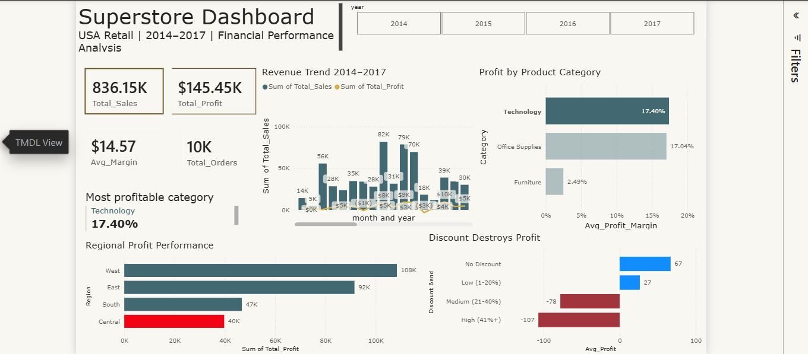

# Superstore Financial Performance Dashboard

## Project Overview
Analysis of US retail sales performance across 4 years (2014–2017), 
covering 3 product categories and 4 regions. 
The project uncovers profitability drivers, regional gaps, 
and the damaging impact of high discounts on profit margins.

## Dashboard Preview

## Key Insights
- **Technology leads profitability** with the highest revenue ($836K) 
  and strongest profit margin (17.4%)
- **West Region dominates** with $108K total profit — 
  nearly 3x the Central Region performance
- **Furniture is a low-margin category** — only 2.49% profit margin 
  despite $742K in sales
- **Discounts destroy profit** — orders with 40%+ discounts 
  generate an average loss of -$107 per order

## Business Recommendations
- **Double down on Technology** — highest margin category, 
  prioritize inventory and marketing investment
- **Investigate Central Region** — negative profit margin (-10.4%) 
  despite significant sales volume requires immediate review
- **Cap discounts at 20%** — data shows discounts above 20% 
  consistently generate losses; explore loyalty programs 
  as profitable alternatives after consulting marketing experts

## Tools Used
- **Python** (Pandas, Matplotlib) — Data cleaning & EDA
- **Power BI** — Interactive financial dashboard & DAX measures
- **Excel** — Data preparation & export

## Files

├── data/
│   ├── superstore_dashboard_data.xlsx
│   └── superstore_dashboard.png
├── superstore_analysis.ipynb
└── README.md

## Connect

